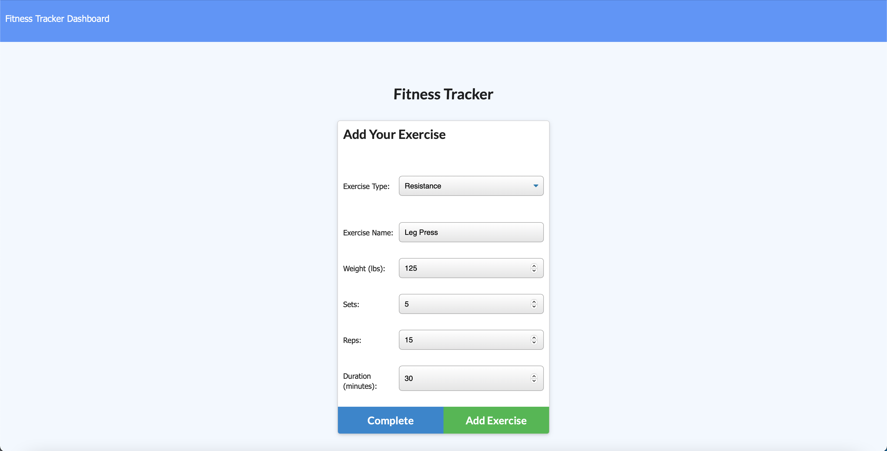
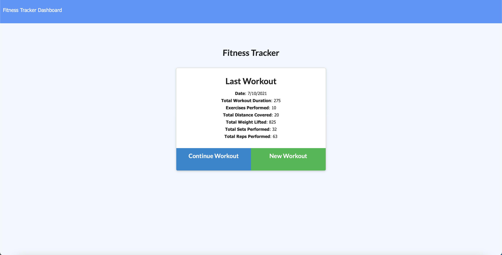
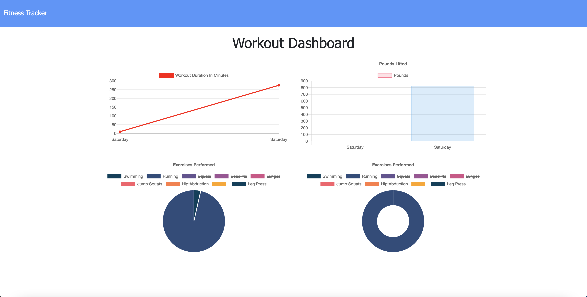

# Workout-Tracker

 

    
    
    
    
    
    
    

## User Story

- As a user, I want to be able to view create and track daily workouts. I want to be able to log multiple exercises in a workout on a given day. I should also be able to track the name, type, weight, sets, reps, and duration of exercise. If the exercise is a cardio exercise, I should be able to track my distance traveled.

## Installation

1. Clone this repository to your local machine.

2. Run `npm install` to install dependencies required for this project.

3. Run `node server.js` to start the application.

# Deployed Website: 
[Workout Tracker](https://enigmatic-lowlands-43601.herokuapp.com/)

# Example

Adding Leg Press as a workout 

After adding all of the workouts

Workout dashboard

## Contact
**Email:**
ctine.ngyn@gmail.com

**GitHub:**
[Christine's GitHub](https://github.com/ctinengyn)